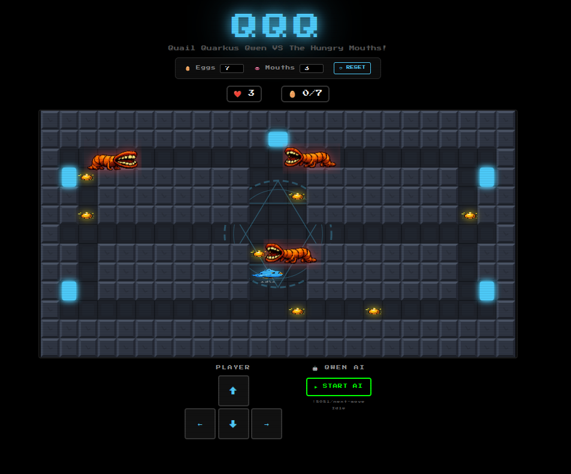

# 🐦 Quail Quarkus Qwen VS The Hungry Mouths!

> **QQQ** stands for **Q**uail **Q**uarkus **Q**wen — an experimental project merging arcade gaming with local Generative AI.



You play as a **quail** navigating a matrix to retrieve golden eggs while dodging the **Hungry Mouths**. The core of the project is the integration of a real-time AI agent — powered by a local LLM — that can take full control of the game.

---

## 🗂️ Repository Structure

```
edoardo@master-node:/media/edoardo/windows/qqq$ ll
totale 32
drwxrwxr-x 1 edoardo edoardo 4096 mar 31 18:51 ./
drwxrwxrwx 1 edoardo edoardo 4096 mar 31 18:36 ../
drwxrwxr-x 1 edoardo edoardo 4096 mar 31 18:37 .git/
-rw-rw-r-- 1 edoardo edoardo  376 mar 31 18:36 .gitignore
-rw-rw-r-- 1 edoardo edoardo 1064 mar 31 18:36 LICENSE
drwxrwxr-x 1 edoardo edoardo 4096 mar 29 15:54 qqq-backend/
drwxrwxr-x 1 edoardo edoardo 4096 mar 29 15:53 qqq-frontend/
-rw-rw-r-- 1 edoardo edoardo   47 mar 31 18:36 README.md
drwxrwxr-x 1 edoardo edoardo    0 mar 31 18:51 screen/
```

| Directory / File | Description |
|---|---|
| `qqq-backend/` | Quarkus Java backend + llama.cpp integration |
| `qqq-frontend/` | Svelte.js frontend (game UI) |
| `screen/` | Screenshots and assets |

---

## 🛠️ Tech Stack

| Layer | Technology |
|---|---|
| **Backend** | [Quarkus](https://quarkus.io/) + [llama.cpp](https://github.com/ggerganov/llama.cpp) + Qwen 2.5 (1.5B) |
| **Frontend** | [Svelte.js](https://svelte.dev/) |
| **AI Engine** | Local LLM in GGUF format with **Grammar-Constrained Decoding** for deterministic decision-making |

---

## 🚀 Getting Started

### 1. Prerequisites

Make sure the following are installed on your local machine:

- **[llama.cpp](https://github.com/ggerganov/llama.cpp)** — to serve the LLM locally.
- **[Qwen2.5-1.5B-Instruct-GGUF](https://huggingface.co/Qwen/Qwen2.5-1.5B-Instruct-GGUF)** — download the `Q4_K_M` quantized model from Hugging Face.
- **[Quarkus CLI](https://quarkus.io/guides/cli-tooling)** — for running the Java backend.
- **[Node.js & npm](https://nodejs.org/)** — for running the Svelte frontend.

---

### 2. Clone the Repository

```bash
git clone https://github.com/RunMyProject/qqq.git
cd qqq
```

---

### 3. Running the Project

#### Step 1 — Start the llama.cpp Server

Launch the LLM server on port **8080**. Once running, verify it is active by checking:

```
http://127.0.0.1:8080/v1/chat/completions
```

> If you get a valid response, the AI engine is ready. ✅

---

#### Step 2 — Launch the Quarkus Backend

Open a **new terminal**, navigate to the backend directory from the project root, and start the dev server:

```bash
cd qqq-backend
quarkus dev
```

---

#### Step 3 — Launch the Svelte Frontend

Open a **third terminal**, navigate to the frontend directory from the project root, and start the UI:

```bash
cd qqq-frontend
npm run dev -- --open
```

If everything is set up correctly, the game screen will open automatically in your browser. 🎮

---

## 🎮 How to Play

The goal is to **collect the Golden Quail Eggs** scattered across the platform.  
You are the **quail** 🐦 — avoid the **Hungry Mouths** that roam the grid trying to stop you!

### Controls

| Method | Description |
|---|---|
| ⌨️ **Keyboard** | Arrow keys to move the quail |
| 🖱️ **Mouse / Touchscreen** | On-screen directional buttons |
| 🤖 **AI Mode** | Click **"Start AI"** and let Qwen play for you! |

---

## 🤖 The AI Logic

When **AI Mode** is active, the Qwen agent analyzes the current game state (quail position, egg positions, enemy positions) and decides the next move autonomously.

The agent uses **GBNF Grammars** to constrain the LLM output, ensuring the response is always a valid game command — no hallucinations, no invalid moves.

### AI Decision Payload Example

```json
{
  "model": "Qwen/Qwen2.5-1.5B-Instruct-GGUF:Q4_K_M",
  "messages": [
    {
      "role": "system",
      "content": "You are an AI playing a matrix game. Analyze coordinates. Avoid enemies. Get eggs. Reply ONLY with the exact word of the best move."
    },
    {
      "role": "user",
      "content": "%s"
    }
  ],
  "max_tokens": 5,
  "temperature": 0.3,
  "grammar": "root ::= (\"right\" | \"left\" | \"up\" | \"down\" | \"stop\")"
}
```

The grammar constraint `root ::= ("right" | "left" | "up" | "down" | "stop")` guarantees that the model will **always** output exactly one valid direction — nothing more, nothing less.

---

## 📄 License

This project is licensed under the terms included in the [`LICENSE`](LICENSE) file.

---

> Developed with passion by **Edoardo Sabatini**. Enjoy the challenge! 🥚🐦
